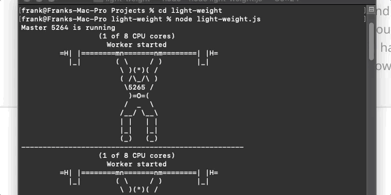

## light-weight
### A simple app to keep the CPU cores busy and not idle!

## The Problem
I had built a "hackintosh" and noticed my audio system's output would stutter or degrade. This was likely related to the kernel extension I was using for system audio. Problem frequency and degree of degredation were inversely related to the load on the CPU, that is to say, when it was idle, it was at it's worst.

## The Solution

I set this to run upon system startup, and it nullified the sound issue, while not putting an appreciable load on the computer to do so.

## License
 
The MIT License (MIT)

Copyright (c) 2020 Frank Santaguida

Permission is hereby granted, free of charge, to any person obtaining a copy of this software and associated documentation files (the "Software"), to deal in the Software without restriction, including without limitation the rights to use, copy, modify, merge, publish, distribute, sublicense, and/or sell copies of the Software, and to permit persons to whom the Software is furnished to do so, subject to the following conditions:

The above copyright notice and this permission notice shall be included in all copies or substantial portions of the Software.

THE SOFTWARE IS PROVIDED "AS IS", WITHOUT WARRANTY OF ANY KIND, EXPRESS OR IMPLIED, INCLUDING BUT NOT LIMITED TO THE WARRANTIES OF MERCHANTABILITY, FITNESS FOR A PARTICULAR PURPOSE AND NONINFRINGEMENT. IN NO EVENT SHALL THE AUTHORS OR COPYRIGHT HOLDERS BE LIABLE FOR ANY CLAIM, DAMAGES OR OTHER LIABILITY, WHETHER IN AN ACTION OF CONTRACT, TORT OR OTHERWISE, ARISING FROM, OUT OF OR IN CONNECTION WITH THE SOFTWARE OR THE USE OR OTHER DEALINGS IN THE SOFTWARE.
